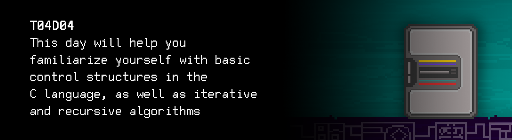

# T04D04
The russian version of the task can be found in the repository.

You can find some useful video materials [here](https://edu.21-school.ru/video/selection/15cb6428-234a-4bd3-9612-1c743554ebea).

  

## Contents

0. [Preamble](#preamble)
1. [Chapter I](#chapter-i) \
    1.1. [Level 1. Room 4.](#level-1-room-4)
2. [Chapter II](#chapter-ii) \
    2.1 [List 1.](#list-1) \
    2.2 [List 2.](#list-2) \
    2.3 [List 3.](#list-3) 
3. [Chapter III](#chapter-iii) \
    3.1. [Quest 1. Basic control structures. Tom Kilburn.](#quest-1-basic-control-structures-tom-kilburn)  
    3.2. [Quest 2. Basic control structures. Some problems with symbols.](#quest-2-basic-control-structures-some-problems-with-symbols)  
    3.3. [Quest 3. Recursive.](#quest-3-recursive)  
    3.4. [Quest 4. Table.](#quest-4-table)  
    3.5. [Quest 5*. Func.](#bonus-quest-5-func)
4. [Chapter IV](#chapter-iv)

# Chapter III

***== Quest 1 received. Create an src/1948.c program that finds the largest prime divisor of any entered integer `a` and prints it to the screen. It is necessary to allocate a separate function for calculating this value. Do not use division and the operation of taking the remainder of the division. However, if necessary, division can be realised by subtraction. For errors, display "n/a". ==***

| Input | Output |
| ------ | ------ |
| 100 | 5 |
| -4 | 2 |

## Quest 2. Basic control structures. Some problems with symbols.

***== Quest 2 received. Create an src/char_decode.c program that takes operation mode 
(0–encoding or 1–decoding) as a command-line parameter. If the decoding mode is selected, 
the program must accept two-character strings separated by a space from stdin and output 
decoded characters separated by a space to stdout. Encoding should involve a reverse 
operation. The subtasks of encoding and decoding should be organized as separate functions. 
Pay attention to the ASCII table. For errors, display "n/a". 
A line break character is a sign of the end of the input. ==***

| Terminal arguments | Input | Output |
| ------ | ------ | ------ |
| 0 | W O R L D | 57 4F 52 4C 44 |
| 0 | WORLD | n/a |
| 1 | 48 45 4C 4C 4F | H E L L O |
| 1 | 48454C4C4F | n/a |

## Quest 3. Recursive.

    46 49 42 4F 4E 41 43 43 49 32 31

***== Quest 3 received. Create an src/quest3.c program that calculates and displays a number from the Fibonacci sequence (e.g. 21) using a recursive algorithm. The search of the specific Fibonacci number must be organized as a separate function. The number is entered via the standard input stream. For errors, display "n/a". ==***

| Input | Output |
| ------ | ------ |
| 21 | 10946 |

## Quest 4. Table.

The witch of Agnesi with diameter one: \
 

The lemniscate of Bernoulli with a unit interval in the positive half-plane: \

Quadratic hyperbola: \
 

***== Quest 4 received. Create an src/door_functions.c program that calculates and displays a table with three functions: the witch of Agnesi with diameter one, the lemniscate of Bernoulli with a unit interval in the positive half-plane (Y > 0), and a quadratic hyperbola. The first column should list the values of the X-axis from minus Pi through plus Pi, there should be 42 measurements at this interval; the second, third, and fourth columns describe the values ​​of the functions at a point. Table headers are not needed. All values must be recorded with an accuracy of 7 decimal places, it is necessary to use the double type for increased accuracy. Column separator: "|". The table should have a total of 42 entries. Put the result of the program in src/data/door_data.txt (no need to add the function of creating a file from the program, you can use output redirection). If the function is not defined at any point, there must be the "-" symbol in the table. ==***

Result:

-3.1415927 | 0.0919997 | - | 0.1013212 
-2.9883442 | 0.1007029 | - | 0.1119796 
................................................................

-1.3026116 | 0.3708103 | 0.3061966 | 0.5893457 
-1.1493632 | 0.4308421 | 0.4310262 | 0.7569818

## Bonus Quest 5*. Func.

\> *Type in "Files are ready"*

Answer in the terminal: 

    Great. The door recovery algorithm can be launched. 
    However, it's possible to speed up the process by modifying your program
    and adding the printing of graphs of functions to it.
    No redundant elements, just a sequence of graphs, one by one, in the same range of definition.
    The knowledge you already have will be enough. 
    Scale on the X-axis – 42 markers; scale on the Y-axis – 21. 
    Draw using the "*" symbol. 
    Although it's not necessary – the acceleration rate will not be too high. 

***== Quest 5 received. Make the necessary additions to the src/door_functions.c program so it draws the graphs of the calculated functions in the terminal using the "\*" symbol. Scale on the X-axis – 42 markers; scale on the Y-axis – 21. The placement and rotation of the coordinate axes are not critical. Save the finished code in door_functions_print.c ==***

