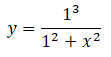
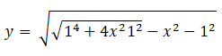

# T04D04

## Contents

1. [MODULES](#MODULES) \
 1.1. [max_prime_divisor](#max-prime-divisor) \
 1.2. [char_decode](#char-decode) \
 1.3. [fibonacci](#fibonacci) \
 1.4. [Quest 4. Table.](#quest-4-table) \
 1.5. [Quest 5*. Func.](#bonus-quest-5-func) 

# MODULES

## max_prime_divisor

> max_prime_divisor.h | max_prime_divisor.c

***Находит наибольший простой делитель заданного целого числа `a` и печатает его на экран. Деление и операция взятия остатка от деления реализована при помощи вычитания. 
В случае ошибки выводится "n/a".***

| Входные данные | Выходные данные |
| ------ | ------ |
| 100 | 5 |
| -4 | 2 |

## char_decode

> char_decode.h | char_decode.c

    48 45 4C 4C 4F 77 4F 52 4C 44 00

***Принимает в качестве параметра режим работы (0 — кодирование или 1 — декодирование). 
Если выбран режим декодирования, то программа должна принимать из stdin разделенные пробелом двухсимвольные строки и выдавать в stdout декодированные символы, разделенные также пробелом. При кодировании выполняется обратная операция. Признаком окончания ввода служит символ переноса строки. Подзадачи кодирования и декодирования выделены в отдельные функции. 
В случае ошибки выводится "n/a".***

| Параметры командной строки | Входные данные | Выходные данные |
| ------ | ------ | ------ |
| 0 | W O R L D | 57 4F 52 4C 44 |
| 0 | WORLD | n/a |
| 1 | 48 45 4C 4C 4F | H E L L O |
| 1 | 48454C4C4F | n/a |

## fibonacci.h | fibonacci.c

    46 49 42 4F 4E 41 43 43 49 32 31

***Рассчитывает и выводит на экран n-ое число Фибоначчи при помощи рекурсивного алгоритма. 
В случае ошибки выводится "n/a".***

| Входные данные | Выходные данные |
| ------ | ------ |
| 21 | 10946 |

## ABH_functions.h | ABH_functions.c

Верзьера Аньези с единичным диаметром: \
 

Лемниската Бернулли с единичным интервалом в положительной полуплоскости: \
 

Квадратичная гипербола: \
 

***Рассчитывает и выводит на экран таблицу из трех функций: Верзьера Аньези с единичным диаметром, Лемниската Бернулли с единичным интервалом в положительной полуплоскости (Y > 0) и квадратичная гипербола. 
В первом столбце перечисляются значения абсциссы от минус Пи до плюс Пи включительно, должно быть 42 замера на этом интервале. Второй, третий и четвертый столбцы описывают значения функций в точке. 
Все значения записываются с точностью до 7 знаков после запятой, необходимо использовать тип double для повышенной точности. Разделитель между столбцами — " | ". 
В случае, если функция не определена в какой-либо точке, в таблице выводится знак "-".***

Результат:

-3.1415927 | 0.0919997 | - | 0.1013212 
-2.9883442 | 0.1007029 | - | 0.1119796 
.....................................................................

-1.3026116 | 0.3708103 | 0.3061966 | 0.5893457 
-1.1493632 | 0.4308421 | 0.4310262 | 0.7569818

## Bonus Quest 5*. Func.

\> *Ввести “Файлы готовы”*

Ответ в терминале: 

    Отлично. Возможен запуск алгоритма восстановления дверей. 
    Однако, есть возможность его ускорить, если модифицировать твою программу и добавить туда печать графиков функций.
    Без лишних элементов, просто графики последовательно, один под другим, в той же области определения.
    Тебе будет достаточно использовать только то, что ты уже знаешь. 
    Масштаб по оси абсцисс — 42 отсечки, масштаб оси ординат — 21. 
    Рисовать с помощью символа “*”. 
    Впрочем, это необязательно — ускорение будет небольшим. 

***== Получен Quest 5. Дополнить программу src/door_functions.c так, чтобы она отрисовывала в терминале графики рассчитываемых функций при помощи символа "\*". Масштаб по оси абсцисс — 42 отсечки, масштаб оси ординат — 21. Расположение и поворот координатных осей не принципиальны. Написанный код сохранить в файл door_functions_print.c ==***

