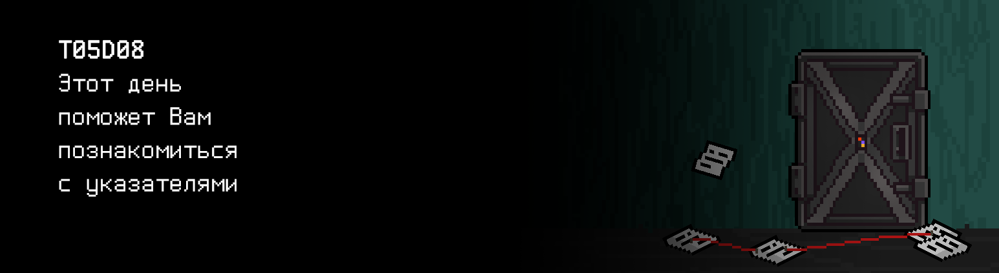

# T05D08

## Contents

1. [MODULES](#modules) \
 3.1.  [Quest 1. Arguments and pointers.](#quest-1-arguments-and-pointers) \
 3.2.  [Quest 2. Data I/O.](#quest-2-data-io) \
 3.3.  [Quest 3. Data metrics.](#quest-3-data-metrics) \
 3.4.  [Quest 4. Search.](#quest-4-search) 
4. [Chapter IV](#chapter-iv)

# MODULES

## Search.
> int input(int *a, int *n);
>  void output(int *a, int n);
>  int max(int *a, int n);
>  int min(int *a, int n);
>  double mean(int *a, int n);
>  double variance(int *a, int n);
>  void squaring(int *asqr, int *a, int n);
>  void search(int *a, int n, double mean_v, double variance_v);
>  int even(int x);
>  int sigma_rule(int x, double mean_v, double variance_v);

***Программа принимает через stdin массив целых чисел и находит в нем первое вхождение числа, удовлетворяющего следующим требованиям: 
  -- четное,
  -- больше или равно математическому ожиданию, 
  -- подчиняется правилу трех сигм,
  -- не равняется 0. 
 В результате выполнения программы выводится:
  -- экстремумы (max и min), 
  -- математическое ожидание и дисперсию,
  -- найденное число, если такого числа нет, то выводится 0. 
 Максимальное количество введенных чисел равно 30. 
 В случае некорректного ввода выводится n/a.***

| Входные данные | Выходные данные |
| ------ | ------ |
| 4 1 2 3 4 | 4 1 2.500000 1.250000 4 |

