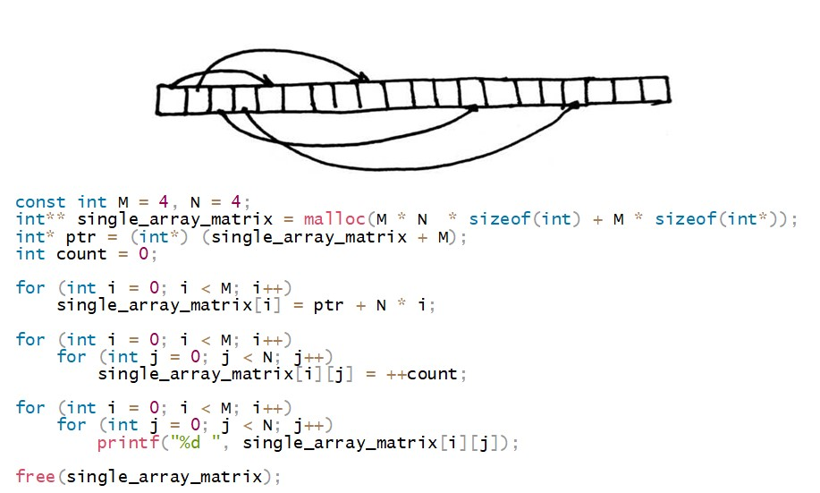
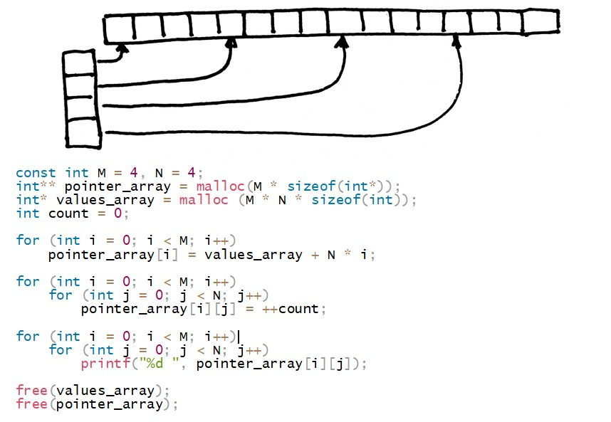

# T07
The russian version of the task can be found in the repository.

## Contents

7. [Modules](#modules) \
 7.1. [sort](#sort) \
 7.2. [matrix_extended](#matrix_extended) \
 7.3. [matrix_arithmetic](#matrix_arithmetic) \
 7.4. [test](#test)

# Modules

## sort

>***sort.h | sort.c***

**The module contains function to sort an array. The memory is allocated for the array dynamically. The length of the array `n` is specified in stdin prior to inputting the array. In case of any error is printed "n/a".**

| Input | Output |
| ------ | ------ |
| 10<br/>4 3 9 0 1 2 100 2 7 -1 | -1 0 1 2 2 3 4 7 9 100 |

<br/>


## matrix_extended

>***matrix_extended.h | matrix_extended.c***

**The module contains functions:**
- **to input and output integer matrices,**
  - matrix memory allocation is implemented in 4 types: 
    - (type 1) one static | for static memory allocation, the maximum size of the matrix does not exceed 100 x 100,
    - (types 2-4) and 3 dynamic ones,
    ***<br/>type 2*** 
      <br/>
      ***<br/>type 3***
      <br/>
      ***<br/>type 4***
      <br/>
  - to select the method of memory allocation in the program is implemented the menu with subparagraphs 1–4 (for types 1-4), 
  - the size of the matrix (first the number of rows, then the columns) is taken from two numbers in stdin right before its input;
- **to calculate the maximum elements of the matrix in each of its rows and the minimum elements in each of its columns and output these values ​​at the end after the output of the matrix as two arrays (an array of maximum elements in each row and an array of minimum elements in each column);**
- **sort the matrix, putting rows with the minimum sum of elements first, followed by rows with the maximum sum of elements.**

n case of any error it is output "n/a".


| Input | Output |
| ------ | ------ |
| 2<br/>3 3<br/>9 0 55<br/>4 3 1<br/>-4 7 111 | 4 3 1<br/>9 0 55<br/>-4 7 111<br/>55 4 111<br/>-4 0 1 <br/>4 3 1<br/>9 0 55<br/>-4 7 111 |

<br/>


## matrix_arithmetic

>***matrix_arithmetic.h | matrix_arithmetic.c***

**The module contains functions:**
- **code 1 – addition of two matrices,**
- **code 2 – multiplication**
- **code 3 – transpose,**
- **menu to choose operation.**

The code of the respective operation must be input before inputting the dimensions and matrices. Matrices are integer-valued. In case of any error, output "n/a".

| Input | Output |
| ------ | ------ |
| 1<br/>2 2<br/>4 3<br/>9 0<br/>2 2<br/>1 1<br/>2 2 | 5 4<br/>11 2 |
| 2<br/>2 3<br/>4 3 1<br/>9 0 2<br/>3 1<br/>1<br/>2<br/>3 | 13<br/>15 |
| 3<br/>2 2<br/>4 3<br/>9 0 | 4 9<br/>3 0 |

<br/>


## test

```c
int main() {
    test_sort();
    test_matrix_extended();
    test_matrix_arithmetic();
    test_task_0();
>}
```
        
>test_sort();

Test the module ***sort***

>test_matrix_extended();

Test the module ***matrix_extended***

>test_matrix_arithmetic();

Test the module ***matrix_arithmetic***

>test_task_0();

Next task is calculated:
> 
                1 T       87  46  57  29
                2    *   129 156 122 141
                3        143 127 107 116
                4         69  78 112 101


<br/>
