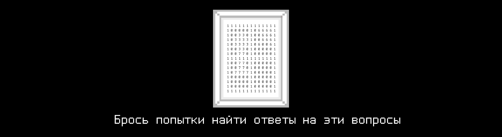

# T07D10 

## Contents

1. [Chapter I](#chapter-i) \
 1.1. [Level 2. Room 3.](#level-2-room-3)
7. [Chapter III](#chapter-iii) \
 7.1. [sort.c](#sort.c) \
 7.2. [Quest 5. Making a picture.](#quest-5-making-a-picture) \
 7.6. [matrix_extended](#matrix_extended) \
 7.7. [matrix_arithmetic](#matrix_arithmetic) \
 7.8. [Quest 8. The Magic Key.](#quest-8-the-magic-key)
4. [Chapter IV](#chapter-iv) 

# Chapter I

## Level 2. Room 3.

***LOADING Level 2…*** \
***LOADING Room 3…***

Стены, дверь, стол, компьютер, листы бумаги, шпаклевка - все на месте. Это успокаивает. 

\> *Попробовать дверь*

Заперто, как и всегда. Повернувшись к столу, Вы замечаете непонятную картинку, висящую на стене рядом.

\> *Рассмотреть поближе*

                1 1 1 1 1 1 1 1 1 1 1 1 1
                1 0 0 0 0 0 1 0 6 6 6 6 1
                1 0 0 3 3 0 1 0 0 6 6 6 1
                1 0 3 3 3 3 1 0 0 6 6 6 1
                1 0 3 3 3 3 1 0 6 0 0 6 1
                1 0 0 3 3 0 1 0 0 0 0 0 1
                1 0 0 7 7 0 1 0 0 0 0 0 1
                1 1 1 1 1 1 1 1 1 1 1 1 1
                1 0 0 7 7 0 1 0 0 0 0 0 1
                1 0 0 7 7 0 1 0 0 0 0 0 1
                1 0 7 7 7 7 1 0 0 0 0 0 1
                1 0 0 0 0 0 1 0 0 0 0 0 1
                1 0 0 0 0 0 1 0 0 0 0 0 1
                1 0 0 0 0 0 1 0 0 0 0 0 1
                1 1 1 1 1 1 1 1 1 1 1 1 1

Некоторое время ломаете голову над вопросом, на что это может быть похоже, кем она была оставлена и для чего. Бросив попытки найти ответы на эти вопросы, Вы подходите к столу с компьютером и стопкой исписанных листов старой бумаги.

\> *Взять верхний лист*

***LOADING...***

# Chapter III

## sort.c

>***sort.c

***Модуль сортирует массив. Память под массив выделяется динамически. Длина массива `n` указывается в stdin перед вводом самого массива. В случае любой ошибки выводится "n/a".***

| Входные данные | Выходные данные |
| ------ | ------ |
| 10 4 3 9 0 1 2 100 2 7 -1 | -1 0 1 2 2 3 4 7 9 100 |

 

## Quest 5. Making a picture.

Зафиксировав очередные изменения в репозитории Вы стали ждать нового “внезапного” обращения к Вам от ИИ. Однако к Вашему удивлению его не последовало.

\> *Ввести “Поиск минмакс значений добавлен”*

    Проверка модулей… … … Предупреждение: Попытка подключения CLI графического модуля - Не успешно
    … 
    “Человек”, мой простейший модуль графики сбоит. Попытка отрисовать то, что вы называете “природа за окном”, провалилась. 
    Зайди в src/picture.c и разберись в чем проблема.

\> *Ввести “Я уже выполнил твои пожелания, теперь мне нужен ключ”*

    …

\> *Ввести “Я не сдвинусь с места, пока не получу ключ”*

    …

\> *Ввести “Я буду писать о том, как не сдвинусь с места, пока не получу ключ”*

    …

Снова молчание. Видимо, сегодня ИИ выбрал политику игнорирования. Внутри src/picture.c Вы видите несколько массивов и матриц из единиц, семерок, шестерок и троек, а также непонятную их обработку в цикле. Вы поневоле обернулись на странную картинку, висящую рядом на стене. Неужели именно ее ИИ хотел отрисовать с использованием данного модуля? \
Стоит попробовать использовать заготовленные массивы для создания новой матрицы, в которой будет “нарисована” данная картинка. И не забыть вывести получившуюся матрицу. 

***== Получен Quest 5. Изменить программу src/picture.c так, чтобы она отрисовывала картинку со [стены комнаты](#level-2-room-3) в терминале при помощи заготовленных в коде массивов и матриц. Статические массивы и матрицы менять нельзя. ==***

***LOADING...***

## matrix_extended

>***matrix_extended.h | matrix_extended.c

***Модуль содержит функции:
 - ввода и вывода целочисленных матриц; 
      выделение памяти под матрицу реализовано в 4 видах: 
         * (type 1) статический | максимальный размер матрицы не превышает 100 x 100,
         * (types 2-4) 3 динамических,
         type 2 : 

         type 3 : 

         type 4 : 
      для выбора способа выделения памяти реализовано меню с подпунктами 1-4 (types 1-4),
      размер матрицы (сперва количество строк, затем столбцов) принимается через два числа в stdin непосредственно до ее ввода, 
 - поиска максимальных элементов матрицы в каждой ее строке и минимальных элементов в каждом ее столбце, которые записываются в два массива,
 - сортировки матрицы так, чтобы сначала шли строки с минимальной суммой элементов, а затем с максимальной. 
На вход подаются числа N и M - размерности матрицы и NxM чисел - элементы матрицы. Память под матрицу выделяется динамически одним из 3х способов. Выбор способа выделения памяти с помощью меню. 
В случае любой ошибки выводится "n/a".***

| Входные данные | Выходные данные |
| ------ | ------ |
| 2 2 2 4 3 9 0 | 4 3 9 0 |

| Входные данные | Выходные данные |
| ------ | ------ |
| 2 3 3 4 3 1 9 0 55 -4 7 111 | 4 3 1 9 0 55 -4 7 111 4 55 111 -4 0 1 |
| Input | Output |
| ------ | ------ |
| 1 3 3 4 3 1 9 0 55 -4 7 -10 | -4 7 -10 4 3 1 9 0 55 |

 

## matrix_arithmetic

>***matrix_arithmetic.h | matrix_arithmetic.c

***Модуль содержит функции: 
 - код 1 - суммирование двух матриц, 
 - код 2 - умножение двух матриц,
 - код 3 - транспонирование матрицы,
 - меню выбора операции.
В меню сначала вводится код соответствующей операции, затем размеры матриц и матрицы. Матрицы целочисленные. В случае любой ошибки выводится "n/a".***

| Входные данные | Выходные данные |
| ------ | ------ |
| 1 2 2 4 3 9 0 2 2 1 1 2 2 | 5 4 11 2 |
| 2 2 3 4 3 1 9 0 2 3 1 1 2 3 | 13 15 |
| 3 2 2 4 3 9 0 | 4 9 3 0 |

 

## Quest 8. The Magic Key.

\> *Ввести “Я починил модуль арифметики, дай мне наконец информацию по ключу!”*

    Проверка модулей… … … Успех

    Запуск поиска информации по 3 комнате 2 уровня… 
    … 
    … 
    …

                1 T       87  46  57  29
                2    *   129 156 122 141
                3        143 127 107 116
                4         69  78 112 101
                
    Решай и советую сохранить ответ в key10.txt. Жду тебя в следующей комнате, когда ты продолжишь ... свой путь ...

Так вот зачем ИИ сказал Вам, что понадобится модуль матричной арифметики. Выглядит несложно, теперь можно подсчитать результат.

***== Получен Quest 8. Решить приведенную задачу и сохранить результат расчетов в src/key10.txt. ==***

***LOADING...***

# Chapter IV

После записи ответа в key10.txt и сохранения всех изменений в репозитории дверь в комнате щелкнула. Белый свет начал сочиться из появившейся щелки вместе со звуками клавиатуры и тихим неразборчивым гулом чьих-то голосов. Что это? Вас зовет новая комната? Или после интенсивной работы Вам начали чудиться разные вещи? Так или иначе способ узнать есть только один… 

***LOADING...***

