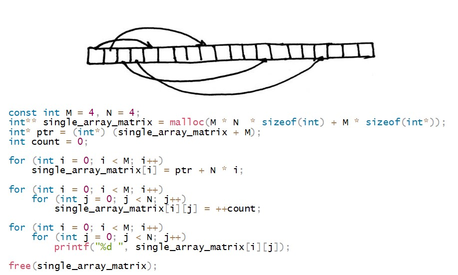
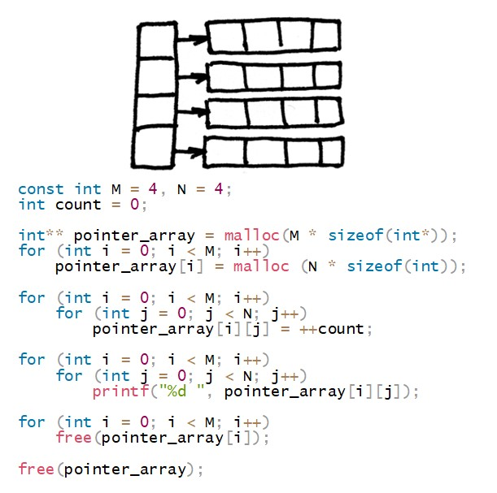
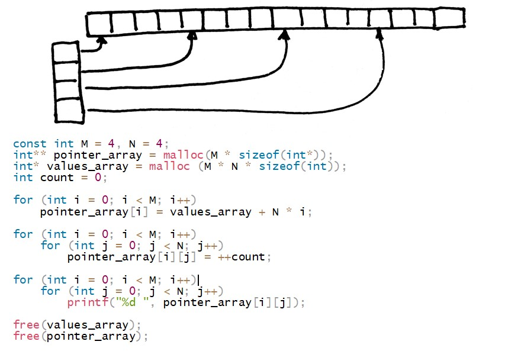

# T07

## Contents

7. [Modules](#modules) \
 7.1. [sort](#sort) \
 7.6. [matrix_extended](#matrix_extended) \
 7.7. [matrix_arithmetic](#matrix_arithmetic) \
 7.8. [test](#test)

# Modules

## sort

>***sort.h | sort.c***

***Модуль сортирует массив. Память под массив выделяется динамически. Длина массива `n` указывается в stdin перед вводом самого массива. В случае любой ошибки выводится "n/a".***

| Входные данные | Выходные данные |
| ------ | ------ |
| 10 4 3 9 0 1 2 100 2 7 -1 | -1 0 1 2 2 3 4 7 9 100 |

 

## matrix_extended

>***matrix_extended.h | matrix_extended.c***

***Модуль содержит функции:
 - ввода и вывода целочисленных матриц; 
     <t>выделение памяти под матрицу, реализовано в 4 видах: 
          >(type 1) статический | максимальный размер матрицы не превышает 100 x 100,
          >(types 2-4) 3 динамических,
          --- type 2 \: 
 
          --- type 3 : 
 
          --- type 4 : 
       ... для выбора способа выделения памяти реализовано меню с подпунктами 1-4 (types 1-4),
       размер матрицы (сперва количество строк, затем столбцов) принимается через два числа в stdin непосредственно до ее ввода, 
 - поиска максимальных элементов матрицы в каждой ее строке и минимальных элементов в каждом ее столбце, которые записываются в два массива,
 - сортировки матрицы так, чтобы сначала шли строки с минимальной суммой элементов, а затем с максимальной. 
 На вход подаются числа N и M - размерности матрицы и NxM чисел - элементы матрицы. Память под матрицу выделяется динамически одним из 3х способов. Выбор способа выделения памяти с помощью меню. 
 В случае любой ошибки выводится "n/a".***

| Входные данные | Выходные данные |
| ------ | ------ |
| 2 2 2 4 3 9 0 | 4 3 9 0 |

| Входные данные | Выходные данные |
| ------ | ------ |
| 2 3 3 4 3 1 9 0 55 -4 7 111 | 4 3 1 9 0 55 -4 7 111 4 55 111 -4 0 1 |
| Input | Output |
| ------ | ------ |
| 1 3 3 4 3 1 9 0 55 -4 7 -10 | -4 7 -10 4 3 1 9 0 55 |

 

## matrix_arithmetic

>***matrix_arithmetic.h | matrix_arithmetic.c***

***Модуль содержит функции: 
 - код 1 - суммирование двух матриц, 
 - код 2 - умножение двух матриц,
 - код 3 - транспонирование матрицы,
 - меню выбора операции.
В меню сначала вводится код соответствующей операции, затем размеры матриц и матрицы. Матрицы целочисленные. В случае любой ошибки выводится "n/a".***

| Входные данные | Выходные данные |
| ------ | ------ |
| 1 2 2 4 3 9 0 2 2 1 1 2 2 | 5 4 11 2 |
| 2 2 3 4 3 1 9 0 2 3 1 1 2 3 | 13 15 |
| 3 2 2 4 3 9 0 | 4 9 3 0 |

 

## test_task_0

\> 
                1 T       87  46  57  29
                2    *   129 156 122 141
                3        143 127 107 116
                4         69  78 112 101

***Вычисляется приведенная задача.***